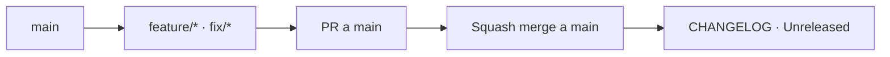

# Branching strategy — openfactura-ruby

Estrategia de ramas de este gem. Es la **fuente de verdad** del flujo; el skill `branch-strategy`
la ejecuta, no la reemplaza.

Es la variante *trunk-based* de la [estrategia de Emeral-next](https://github.com/EmeralHQ/Emeral-next/blob/develop/docs/BRANCHING_STRATEGY.md).
Comparte nombres de rama, convención de títulos de PR y squash merge; **no** tiene `develop`,
`release/*` ni back-merge, porque un gem no tiene staging ni deploy: lo que se "despliega" es una
versión publicada en RubyGems, y eso lo marca un tag.

## Objetivos

- Mantener `main` siempre publicable: cualquier commit de `main` debe poder salir como release.
- Un solo camino para llegar a `main`: PR con squash merge.
- Que la versión publicada en RubyGems sea siempre reproducible desde un tag.

## Ramas

- **`main`**: única rama de larga vida. Es el trunk y la base de todo PR.
- Ramas de trabajo, cortas, siempre desde `origin/main`:

| Tipo | Nombre | Para qué |
|------|--------|----------|
| Feature | `feature/<user>/<slug>` | Funcionalidad nueva (endpoint, clase DSL, campo) |
| Fix | `fix/<user>/<slug>` | Corrección de bug |
| Docs / chore | `docs/<slug>` · `chore/<slug>` | Documentación, skills, tooling |
| Release | `release/vX.Y.Z` | Solo el bump de versión y el cierre del changelog |

`<user>` = handle de git del autor (ej. `calrrox`).

## Flujo diario

1. `git checkout -b feature/<user>/<slug> origin/main`
2. Trabajo y commits (ver skill `commit`).
3. `git push -u origin <rama>`
4. PR con base `main` usando `.github/PULL_REQUEST_TEMPLATE.md`.
5. CI verde (`bundle exec rspec` + `bundle exec rubocop`) y **squash merge**.

No hay deploy automático: mergear a `main` **no** publica nada. Publicar es un acto explícito (ver abajo).

## CI y protección de `main`

`main` está protegida por un ruleset de GitHub. Lo que la regla exige es exactamente lo que el flujo
de arriba pide, pero sin depender de que alguien se acuerde:

| Regla | Por qué |
|-------|---------|
| No se puede pushear directo a `main` | Todo entra por PR |
| PR con 1 aprobación y las conversaciones resueltas | Revisión real, no un sello |
| Checks obligatorios: `Test (Ruby 3.1)`…`(3.4)`, `RuboCop`, `Build gem` | `main` siempre publicable |
| Branch actualizada con `main` antes de mergear | Evita el merge semánticamente roto que ningún PR vio |
| Solo squash merge | Un commit por PR (`allow_merge_commit` y `allow_rebase_merge` están apagados) |
| Prohibido borrar `main` y forzar push | Un tag publicado tiene que seguir siendo alcanzable |

La CI vive en [.github/workflows/ci.yml](../.github/workflows/ci.yml) y corre en cada PR y push a
`main`: `bundle exec rspec` sobre la matriz Ruby 3.1–3.4 (el rango que promete el gemspec),
`bundle exec rubocop` y `bundle exec rake build` —que instala y carga el `.gem` resultante solo con
sus dependencias de runtime, para que un gemspec roto se vea acá y no durante el release—.

Los specs `:integration` **no** corren en CI: pegan al sandbox real y necesitan credenciales.
`spec_helper` los excluye por defecto; se corren a mano con `RUN_INTEGRATION=1`.

La CI tiene permisos de solo lectura y no publica nada: publicar sigue siendo un tag + `rake release`.

## Release

El release de un gem es un tag, no un merge de una rama de larga vida. Lo ejecuta el skill `release`.

1. `git checkout -b release/vX.Y.Z origin/main`
2. Solo dos cambios en esa rama: bump de `lib/openfactura/version.rb` y cierre de la sección
   `## [Unreleased]` del `CHANGELOG.md` a `## [X.Y.Z] - YYYY-MM-DD`. **Sin scope creep**: si aparece un
   bug, va en su propio `fix/*` a `main` antes del release.
3. PR con base `main` → squash merge.
4. Tag `vX.Y.Z` sobre `main` + GitHub release (draft primero).
5. `bundle exec rake release` publica a RubyGems (requiere MFA, `rubygems_mfa_required` está activo).

## Hotfix

No hay rama `hotfix/*` ni back-merge: como `main` es la única rama de larga vida, un hotfix es un
`fix/<user>/<slug>` normal desde `origin/main` seguido de un release de patch (`vX.Y.Z+1`). No existe
la divergencia que el back-merge de Emeral-next resuelve.

Un gem no se puede "rollbackear": una versión publicada en RubyGems no se despublica (`yank` la
esconde pero no la borra, y rompe los `Gemfile.lock` que ya la fijaron). El rollback real es publicar
una versión de patch nueva. Por eso el listón para mergear a `main` es la CI verde, no la posibilidad
de revertir.

## Versionado (SemVer)

El gem está en `0.x`: la API pública **no** es estable todavía.

| Cambio | Bump |
|--------|------|
| Rompe la API pública (renombrar/quitar un método, campo o clase; cambiar un default) | minor (`0.1.0` → `0.2.0`) |
| Agrega funcionalidad compatible hacia atrás | minor |
| Fix compatible hacia atrás | patch (`0.1.0` → `0.1.1`) |

Desde `1.0.0` en adelante aplica SemVer estricto: los breaking changes pasan a ser major.
La API pública del gem es todo lo que un consumidor puede llamar: los métodos de `Openfactura::Client`,
las clases DSL y sus campos, los nombres de las clases de error y la configuración. Cambiar el mapeo
interno de `to_api_hash` **sí** es breaking si cambia el JSON que la API recibe.

## Convenciones de PR

- Título: `type(scope): descripción en español` — mismos types y scopes que el skill `commit`.
- PRs pequeños y con tests. Squash merge siempre.
- La plantilla `.github/PULL_REQUEST_TEMPLATE.md` se rellena completa, con datos reales del diff.
